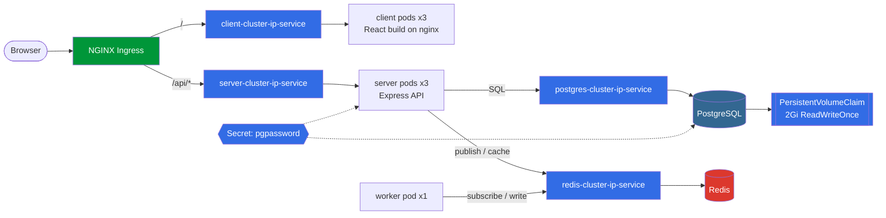
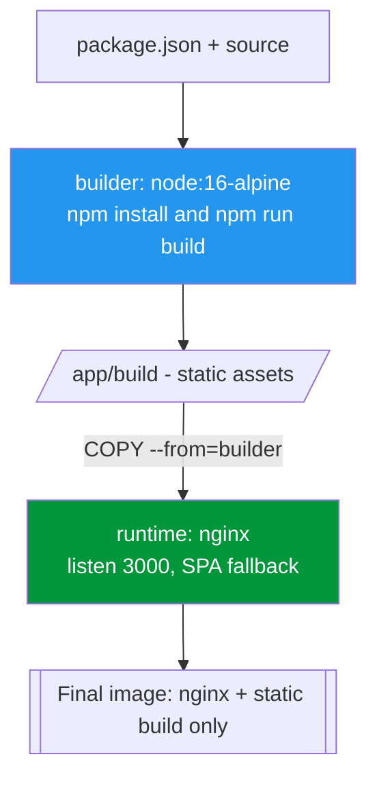
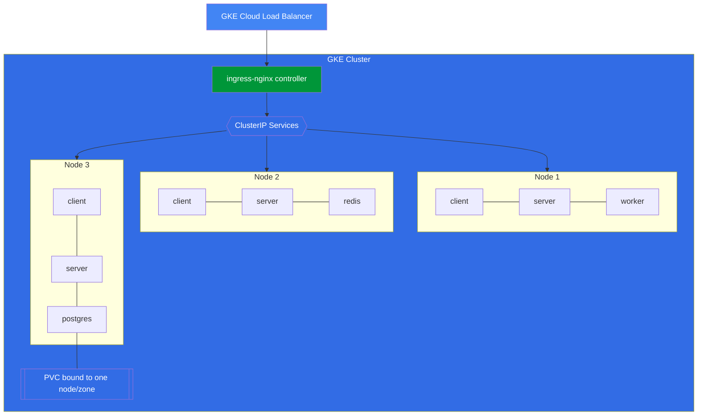
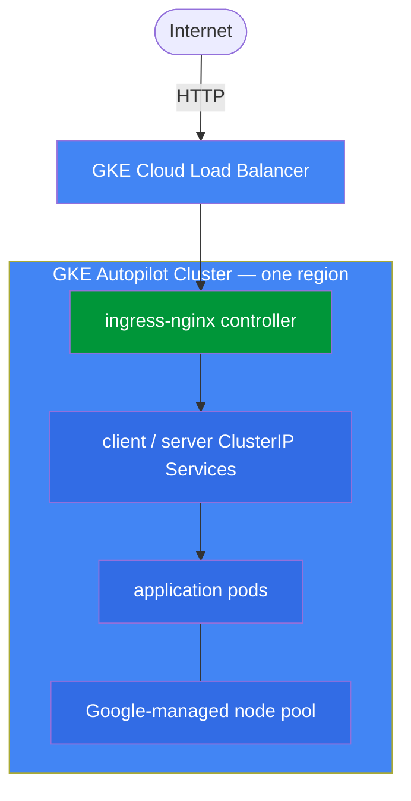

# Multi-Service Kubernetes Application on Google Cloud (GKE)

A containerized, multi-service application orchestrated by **Kubernetes** and deployed to **Google Kubernetes Engine**, with a fully automated CI/CD pipeline that tests, builds, and rolls out Docker images on every push to `main`.

The project follows a well-established microservices reference pattern — a client, a stateless API service, and an asynchronous background worker, backed by a relational store and an in-memory cache — implemented the way it would actually be run on a cluster: independently built and versioned images, `kubectl`-driven rolling deployments, environment-driven configuration, ClusterIP services fronted by a single Ingress, and persistent storage for stateful workloads. (Reference architecture from Stephen Grider's *Docker & Kubernetes: The Complete Guide*.)

## Table of Contents

- [Architecture](#architecture)
- [Tech Stack](#tech-stack)
- [Containerization Strategy](#containerization-strategy)
- [Kubernetes Orchestration](#kubernetes-orchestration)
- [Local Development](#local-development)
- [CI/CD Pipeline](#cicd-pipeline)
- [Google Cloud Deployment (GKE)](#google-cloud-deployment-gke)
- [Environment Variables](#environment-variables)
- [Project Structure](#project-structure)
- [Skills Demonstrated](#skills-demonstrated)

## Architecture

Five containers run as Kubernetes Deployments. Only the Ingress is reachable from outside the cluster — every service talks to every other service over stable in-cluster DNS.



The Ingress routes browser traffic by path: `/` goes to the `client` pods, everything under `/api/*` is proxied to the `server` pods with the `/api` prefix stripped. The API is stateless — it persists submitted values in PostgreSQL and hands expensive work to the worker via Redis pub/sub, so the request never blocks on the computation.

## Tech Stack

| Layer | Technology |
|---|---|
| Frontend | React (Create React App), served as static assets by nginx |
| API | Node.js / Express |
| Background processing | Node.js worker, Redis pub/sub |
| Ingress / routing | NGINX Ingress Controller |
| Relational data | PostgreSQL (`postgres:13`) |
| Cache / message broker | Redis |
| Containerization | Docker (multi-stage builds) |
| Orchestration | **Kubernetes** |
| CI/CD | GitHub Actions (migrated from Travis CI) |
| Cloud hosting | Google Kubernetes Engine (Autopilot) |
| Persistent storage | Kubernetes PersistentVolumeClaim → Google Compute Engine persistent disk |

## Containerization Strategy

Each service ships its own `Dockerfile`, and every service keeps **separate development and production images** — dev images run the framework's watcher (`react-scripts start` / `nodemon`) for hot reload, while production images contain only what's needed to run.

The client image uses a genuine **multi-stage build**: a `builder` stage compiles the React app to static assets, and a clean `nginx` stage copies only the compiled `build/` output into the final image (nothing from `node_modules` or source ships). Every image is tagged twice on each pipeline run — `:latest` and an immutable `:<git-sha>` — and Deployments are pinned to the SHA tag so a rollout is reproducible and `kubectl rollout undo` returns to a known image.



## Kubernetes Orchestration

All manifests live in [`k8s/`](k8s/) and are applied with `kubectl apply -f k8s`.

| Kind | Objects |
|---|---|
| Deployment | `client-deployment` (3), `server-deployment` (3), `worker-deployment` (1), `postgres-deployment` (1), `redis-deployment` (1) |
| Service (ClusterIP) | `client-cluster-ip-service`, `server-cluster-ip-service`, `postgres-cluster-ip-service`, `redis-cluster-ip-service` |
| Ingress | `ingress-service` (`ingressClassName: nginx`) |
| PersistentVolumeClaim | `database-persistent-volume-claim` (2Gi, `ReadWriteOnce`) |
| Secret | `pgpassword` (injected into the server and postgres pods) |



- **ClusterIP only** — no `NodePort` or `LoadBalancer` on the app services; the Ingress is the single entry point, so the database and cache are unreachable from outside by construction.
- **Ingress path routing** — `/?(.*)` → `client:3000`, `/api/?(.*)` → `server:5000`, with `nginx.ingress.kubernetes.io/rewrite-target: /$1` stripping the `/api` prefix.
- **Service discovery via env** — the API and worker find Redis and Postgres by Service name (`redis-cluster-ip-service`, `postgres-cluster-ip-service`), injected through the container `env:` in each Deployment; the same image runs unchanged locally and in the cloud.
- **Stateful Postgres** — a single replica bound to a `ReadWriteOnce` PVC (mounted at `/var/lib/postgresql`, `subPath: postgres`); the volume must be released by the old pod before a new one attaches.
- **Rolling updates** — the pipeline runs `kubectl set image deployment/<name> <container>=<image>:<git-sha>`, so GKE drains old pods only as new pods pass readiness; `kubectl rollout undo` reverts.

## Local Development

Local development targets the **single-node Kubernetes cluster built into Docker Desktop**, so the same manifests that run in GKE run on the laptop.

```bash
kubectl config use-context docker-desktop

# NGINX Ingress controller (provides the "nginx" ingress class)
kubectl apply -f https://raw.githubusercontent.com/kubernetes/ingress-nginx/main/deploy/static/provider/cloud/deploy.yaml

# database password secret (referenced by two deployments, never committed)
kubectl create secret generic pgpassword --from-literal PGPASSWORD=postgres_password

kubectl apply -f k8s
kubectl get pods -w
open http://localhost
```

For fast iteration on one service without a redeploy, build its `Dockerfile.dev` and run it with a bind-mounted source tree for hot reload.

## CI/CD Pipeline

Every push to `main` triggers [`.github/workflows/main.yml`](.github/workflows/main.yml) (GitHub Actions — originally Travis CI, since migrated):


1. **Test** — the client test suite runs inside its own dev container with `CI=true`; a failure aborts the run before anything is deployed.
2. **Authenticate** — `google-github-actions/auth` reads a service-account key from a secret; `get-gke-credentials` fetches cluster credentials and installs `gke-gcloud-auth-plugin` for `kubectl`.
3. **Build & push** — `deploy.sh` (`set -e`) builds the client, server, and worker images and pushes each as `:latest` and `:<git-sha>` to Docker Hub.
4. **Apply** — `kubectl apply -f k8s` reconciles the manifests.
5. **Roll out** — `kubectl set image` pins each Deployment to the new SHA tag, triggering a zero-downtime rolling update.

Credentials (`GCP_SA_KEY`, `DOCKER_USERNAME`, `DOCKER_PASSWORD`) are injected via CI secrets — never committed to the repo.

## Google Cloud Deployment (GKE)



- **Cluster** — `gcloud container clusters create-auto <cluster> --project <gcp-project-id> --region <region>` (Autopilot; Google manages the nodes).
- **Deploy identity** — a dedicated service account granted only `roles/container.developer`; its JSON key is stored as the `GCP_SA_KEY` GitHub secret, never on disk in the repo (`service-account.json` is git-ignored).
- **In-cluster bootstrap** — install ingress-nginx and create the `pgpassword` secret directly against the cluster.
- **Verify** — `kubectl rollout status deployment/<name>`; the app is reachable at the external IP of the ingress-nginx controller Service.

## Environment Variables

No values are stored in the repository. In the cluster these are set on each Deployment's `env:` — the `PG*` / `REDIS_*` hosts point at the ClusterIP Service names, and `PGPASSWORD` is pulled from the `pgpassword` Secret.

| Variable | Purpose |
|---|---|
| `PGHOST` / `PGPORT` | PostgreSQL host (`postgres-cluster-ip-service`) / port |
| `PGUSER` / `PGDATABASE` | PostgreSQL user / database name |
| `PGPASSWORD` | PostgreSQL password (from Secret `pgpassword`) |
| `REDIS_HOST` / `REDIS_PORT` | Redis host (`redis-cluster-ip-service`) / port |

## Project Structure

```
.
├── client/               # React frontend — multi-stage Dockerfile (build → nginx static)
├── server/               # Express API — stateless; PostgreSQL + Redis via env config
├── worker/               # Background processor — subscribes to Redis, computes results
├── k8s/                  # All Kubernetes manifests (Deployments, Services, Ingress, PVC)
├── .github/workflows/    # GitHub Actions CI/CD pipeline
├── .travis.yml           # Legacy CI/CD definition (pre-migration)
└── deploy.sh             # Build & push images, kubectl apply, kubectl set image
```

## Skills Demonstrated

- Kubernetes Deployments / ReplicaSets with rolling updates and rollback (`kubectl set image`, `kubectl rollout undo`)
- ClusterIP Services and an NGINX Ingress with regex path routing and prefix rewriting
- PersistentVolumeClaims and single-writer stateful workloads on `ReadWriteOnce` storage
- Kubernetes Secrets and environment-driven configuration / service discovery
- Multi-stage Docker builds producing minimal, production-only images; immutable SHA-based image tags
- GitHub Actions CI/CD design — test-gated, push-to-deploy — migrated from Travis CI
- GKE cluster provisioning and least-privilege IAM service accounts for automated deploys
- Secrets kept entirely out of source control, injected via CI and in-cluster

---

*Deployment manifests reference upstream `stephengrider/multi-*` images; the pipeline's `kubectl set image` step overrides each Deployment to the project's own `<dockerhub-user>/multi-*:<git-sha>` image at deploy time.*
